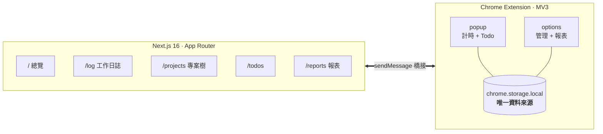
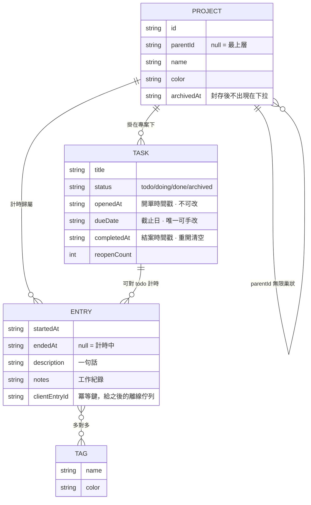
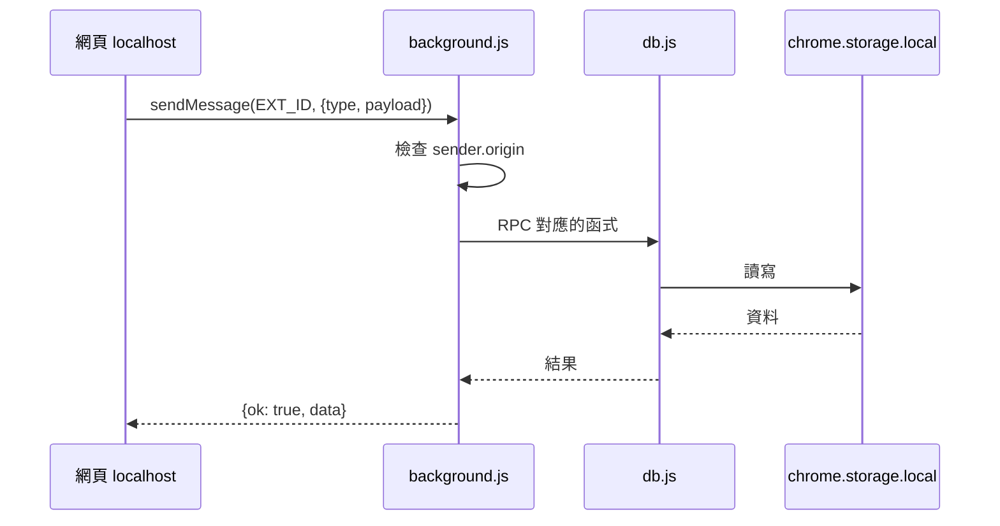

<div align="center">

# ⏱️ TodoTracker

**一鍵計時的專案時間追蹤器**

Chrome 擴充負責計時，Next.js 網頁負責管理與報表<br/>
沒有後端、沒有資料庫、沒有登入 —— 資料就在你自己的瀏覽器裡

<br/>


<!-- 截圖補上後把這行換成  -->

</div>

---

## 這是什麼

想知道「今天到底做了什麼」，但市面上的工具都要註冊、要訂閱、要把資料交出去。

所以做了這個：**計時器住在 Chrome 工具列，按一下就開始**。做事的時候隨手記下發生什麼，收工按一顆按鈕，就得到一份可以直接貼進日報的 Markdown。



網頁**沒有自己的資料庫**。它透過 `chrome.runtime.sendMessage` 打進擴充讀寫，所以在網頁建的專案，popup 的下拉會立刻出現；在 popup 按下的計時，網頁 5 秒內同步顯示。

---

## ✨ 功能

| | 功能 | 說明 |
|:-:|---|---|
| ⏱️ | **一鍵計時** | 點圖示就開始，或在 popup 按空白鍵。計時中可直接換專案、改描述，不用重開 |
| 📝 | **即時工作紀錄** | 邊做邊寫，打字停 0.5 秒自動存。`[時間]` 按鈕插入 `HH:MM`，自然排成一條時間線 |
| 🌳 | **專案樹** | 專案可以無限往下掛子專案，時數自動向上累加 |
| ✅ | **Todo 生命週期** | 開單 → 截止 → 結案全程記錄，可重新打開，算得出歷時與逾期天數 |
| 📊 | **三種圖表** | 甜甜圈（可鑽取）、折線（每日趨勢）、時間軸（日曆式） |
| 📋 | **一鍵複製總結** | 把當日工作整理成 Markdown 丟進剪貼簿 |
| 😴 | **閒置偵測** | 忘記按停止？回來時問你要不要扣掉離開的那段 |
| 💾 | **匯出備份** | CSV（含 BOM，Excel 直接開）與 JSON 完整備份還原 |

---

## 📸 畫面

> [!NOTE]
> 截圖還沒補上。規格與檔名寫在 [`docs/images/README.md`](docs/images/README.md)。

| 畫面 | 你會看到 |
|---|---|
| **擴充 popup** | 深色計時面板顯示 `01:23:45`，底下是專案／Todo 下拉與可自動長高的工作紀錄框，最下面今日／本週統計與最近紀錄 |
| **報表** | 甜甜圈中央是總時數，右側圖例列出各專案時數與佔比；有子專案的列標 `[+]`，點進去換成看那一層 |
| **時間軸** | 橫軸日期、縱軸時刻，每筆紀錄是一個色塊，位置就是實際幾點到幾點，像日曆週檢視 |
| **工作日誌** | 按日期分組，每筆下面一個輸入框，移開游標就存。上方顯示「今天還有 N 筆沒寫」 |
| **專案樹** | 縮排的樹狀清單，右邊兩個數字：含子專案的總時數、只算這一層的時數 |
| **Todo** | 每列帶「歷時 5 天」「逾期 3 天」「重開 2 次」等 badge，底下一行是開單／截止／結案三個時間 |

<details>
<summary><b>複製出來的 Markdown 長這樣</b></summary>

<br/>

```markdown
## 2026-07-30 工作總結

總時數 **3h 40m** · 3 筆

### 稅則 / 土地稅 — 2h 00m

- **09:00–10:30** 處理土地稅的 c2q 狀況 · 1h 30m
  - 09:12 發現 API 回傳格式不一致
  - 09:40 改用批次查詢
- **15:30–16:00** 補文件 · 30m

### LLM 實驗 — 1h 40m

- **13:40–15:20** 測 embedding 快取 · 1h 40m
  - 命中率 62%

### 完成的 Todo

- [x] 測 embedding 快取 _(LLM 實驗)_ — 開單 2026-07-25 · 截止 2026-07-31 · 歷時 5 天 · 工時 2h 30m
```

</details>

---

## 🚀 快速開始

### 1️⃣ 載入擴充

`chrome://extensions` → 開啟「開發人員模式」→ 載入未封裝項目 → 選 `extension/`

> [!TIP]
> 記得把圖示釘選到工具列。這樣就能用了 —— 擴充本身不需要網頁也能跑。

### 2️⃣ 跑網頁（想要大畫面的管理與報表才需要）

```bash
cd web
npm install
npm run dev
```

打開 <http://localhost:3000>，右上角顯示 **已連線擴充** 就成功了。

> [!IMPORTANT]
> 網址必須是 `localhost` 或 `127.0.0.1`。擴充的 `externally_connectable` 只信任這兩個來源，這是刻意的安全邊界。

---

## 🗂️ 專案結構

```
TodoTracker
├── DESIGN.md          設計系統（改編 getdesign.md 的 OpenCode 分析）
├── docs/
│   ├── ARCHITECTURE.md
│   └── images/        截圖
├── extension/         Chrome 擴充 · 零 build step
│   ├── manifest.json
│   └── src/
│       ├── background.js   MV3 SW：badge、alarm、閒置、網頁橋接
│       ├── lib/            db · time · tree · tasks · charts · summary · collapse · autogrow
│       ├── popup/          計時 + Todo
│       └── options/        報表 / 專案 / Todo / 標籤 / 紀錄 / 設定
├── web/               Next.js 16 App Router
│   ├── app/           6 個路由，全部 client component
│   ├── components/    TimerPanel · Charts · Section · CopyButton · AutoTextarea
│   └── lib/           bridge · store · time · tree · tasks · summary · types
└── supabase/
    └── schema.sql     多人 team 的 Postgres schema + RLS（尚未接上）
```

---

## 🧩 資料模型



---

## 🧠 幾個有意思的技術決定

<details>
<summary><b>MV3 service worker 會被殺掉，所以計時器不能有狀態</b></summary>

<br/>

MV3 的 background 是 service worker，**閒置約 30 秒就被系統回收**。如果用 `setInterval` 在裡面累加秒數，一被回收就全部歸零。

所以計時器只存一個 `startedAt` 時間戳到 `chrome.storage.local`，經過時間一律用 `Date.now() - startedAt` 現算。SW 被殺再醒來也不會掉秒，重開瀏覽器也能接回去。

工具列 badge 的分鐘數用 `chrome.alarms` 更新（最小週期 1 分鐘，這是 MV3 的限制）；popup 開著時自己跑 `setInterval` 顯示秒數，關掉就停。

</details>

<details>
<summary><b>網頁怎麼讀寫擴充的資料</b></summary>

<br/>



`manifest.json` 裡設 `externally_connectable`，只允許 `localhost` 與 `127.0.0.1` 對擴充發訊息。`background.js` 收到後再檢查一次 `sender.origin`，才轉成 `db.js` 的函式呼叫。

擴充 ID 由 manifest 裡的固定 `key`（RSA 公鑰）決定，所以重新載入也不會變，網頁可以寫死不用猜。

</details>

<details>
<summary><b>圖表是手寫 SVG，沒有裝 Chart.js</b></summary>

<br/>

三張圖（甜甜圈、折線、時間軸）都是純 SVG 字串／JSX，加起來不到 300 行。

原因：擴充刻意保持**零 build step**，改完檔案按重新載入就生效。為了畫圖去引入打包流程，代價比自己算座標大得多。而且設計系統要求零陰影、hairline 格線、等寬字，用現成套件反而要一路覆寫樣式。

甜甜圈用 `stroke-dasharray` + `stroke-dashoffset` 疊圓弧；時間軸把跨午夜的紀錄切成兩段、重疊的區間分配到不同 lane 並排。

</details>

<details>
<summary><b>db.js 是唯一的 I/O 邊界</b></summary>

<br/>

擴充的所有資料存取都經過 `extension/src/lib/db.js`，網頁的都經過 `web/lib/bridge.ts`。欄位命名從第一天就跟 `supabase/schema.sql` 對齊（包含專案樹的 `parentId`、離線佇列冪等用的 `clientEntryId`）。

要接雲端的話，只需要換這兩個檔的實作，頁面與元件一行都不用動。

</details>

---

## 🗺️ Roadmap

- [x] 計時器 + 專案 + 標籤 + Todo
- [x] 即時工作紀錄與 Markdown 總結
- [x] 專案無限巢狀 + 統計向上累加
- [x] 甜甜圈 / 折線 / 時間軸三種圖表
- [x] Todo 開單 → 截止 → 結案全程記錄
- [ ] 補上截圖
- [ ] 接上 Supabase，多裝置同步
- [ ] 多人 team 與邀請流程
- [ ] 自動偵測網站 → 對應專案
- [ ] Pomodoro 模式

---

## 🔐 資料在哪、安全嗎

全部在你自己瀏覽器的 `chrome.storage.local`，**沒有任何網路請求**。擴充只要三個權限：`storage`、`alarms`、`idle`。

換電腦前記得到 **設定 → 匯出備份 JSON**。

> [!WARNING]
> `extension-key.pem` 是決定擴充 ID 的私鑰，已經在 `.gitignore` 裡。弄丟的話 ID 會變，網頁那邊要重設 `NEXT_PUBLIC_EXTENSION_ID`。建議另外備份。

---

## 📚 更多文件

| 文件 | 內容 |
|---|---|
| [`extension/README.md`](extension/README.md) | 擴充的安裝、快捷鍵、檔案結構 |
| [`web/README.md`](web/README.md) | 網頁的頁面說明、環境變數 |
| [`DESIGN.md`](DESIGN.md) | 色票、字級、間距、元件規格、ASCII 標記語彙 |
| [`docs/ARCHITECTURE.md`](docs/ARCHITECTURE.md) | 資料模型、權限設計、同步策略、已知風險 |

---

<div align="center">

**MIT License**

用等寬字與暖白底做的 · 設計語彙來自 [getdesign.md](https://getdesign.md/opencode.ai/design-md)

</div>
